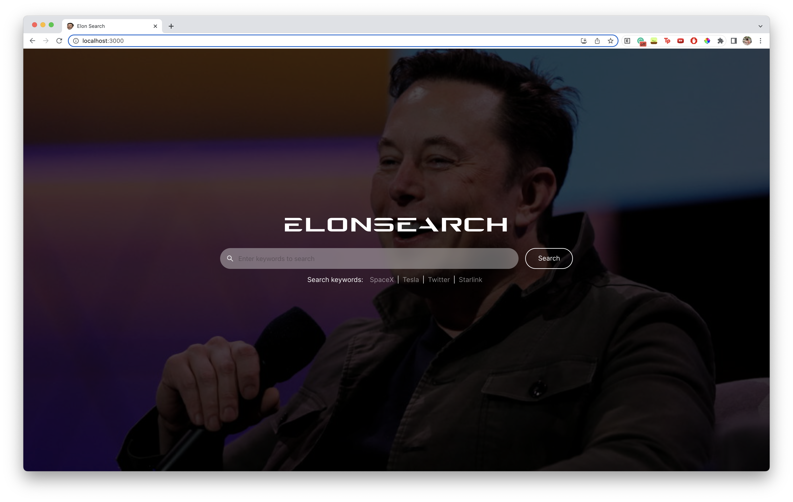

# ElonSearch
## CZ4034_InfoRet Group 25

In this project, our team built an information retrieval system for social media content related to Elon Musk, with sentiment analysis on the public’s opinion of him. Our team crawled a text corpus containing Tweets and Reddit content, created a search engine to query the crawled corpus and performed sentiment analysis on them. This report will document the steps taken in crawling the data, the development of the search engine as well as the classification task for the sentiment analysis.

Team members who contributed to the success of the project:
- Paing Khantt Lin
- Lim Wei Ze
- Lim ZhengWei Trevor
- Sim Shi Qian 
- Josephine Agatha Hemingway

This repository contains the source codes of the information retrieval system developed by 
CZ4034-Information Retrieval Group 25 for the course project. The detailed explanation on how to compile and run the source codes are found in the README files in the subfolders of each of the sub-questions for the project.

The README files for each of the sub-questions are found in sub-folders:

- Backend
- Frontend
- 
## YouTube Video Presentation & Demo:
A presentation video was created to explain the applications and demonstrate the application.

YouTube link: https://www.youtube.com/watch?v=MjpSZRNFwA4

## App Screenshots
### Landing Page

### Search Results Page

